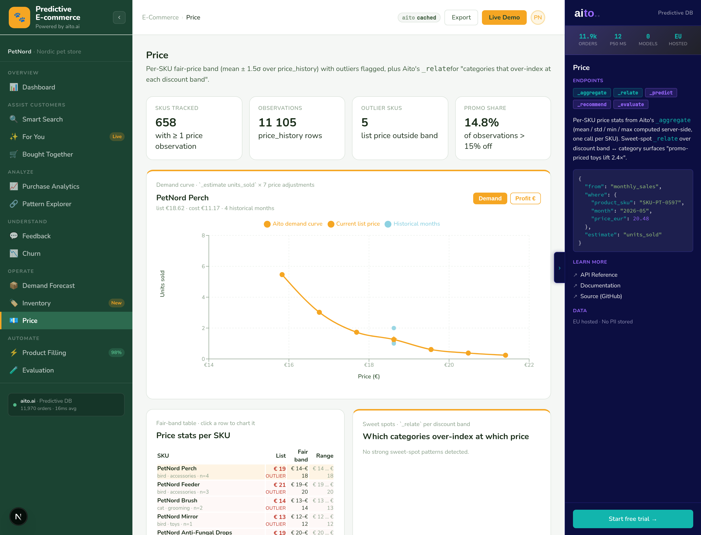

# Predictive E-commerce — Aito.ai demo

> What an online store looks like when predictions are native to
> every screen: search, recommendations, cross-sell, catalog
> enrichment, customer-feedback triage, churn prediction, demand
> forecast, inventory reorder, price intelligence. **No model
> training. No retraining schedule. No MLOps.** Powered by
> [Aito.ai](https://aito.ai)'s predictive database. Thirteen
> views, all live against the same Aito DB.

[](LICENSE)
[](https://aito.ai)
[](#companion-demos)

Family-line brand: **Predictive E-commerce** · matches the sibling
demos [`aito-accounting-demo`](https://github.com/AitoDotAI/aito-accounting-demo)
(*Predictive Ledger*) and
[`aito-erp-demo`](https://github.com/AitoDotAI/aito-erp-demo)
(*Predictive ERP*). PetNord is the dataset — a Nordic-flavoured
online pet store with ~700 SKUs, 3,000 customers, 12,000 orders,
39,000 order lines, 6,000 reviews, ~26,500 customer-month panel
rows, ~11,100 SKU-month sales aggregates, 658 inventory snapshots,
and ~11,100 price observations.


---

## Try it now

The cheatsheet ([`docs/aito-cheatsheet.md`](docs/aito-cheatsheet.md))
carries verified live query bodies for every endpoint. A one-line
probe against the live PetNord DB:

```bash
# Lift query — "what's bought with dog dry-food?" — same body the
# Bought Together view runs on every anchor change.
curl -X POST https://shared.aito.ai/db/aito-ecommerce-demo/api/v1/_relate \
  -H "x-api-key: $AITO_API_KEY" \
  -H "content-type: application/json" \
  -d '{
    "from": "orders",
    "where": { "line_categories": { "$match": "dog_dryfood" } },
    "relate": "line_categories",
    "limit": 5
  }'
# → dog_dentaltreats lift 2.72×, dog_wetfood 1.54×, dog_treats 1.53×, …
```

Returns in ~200 ms. Same query the Dashboard's top-patterns row
runs in parallel × 6 anchors.

---

## The nine demo moments

Nine visible, quotable predictions form the demo's narrative.
Each is in its own view, each builds on the previous:

| # | Moment | View | Aito |
|---|---|---|---|
| 1 | Smart Search rank flip — cat food drops from rank 1 to rank 6 for a dog-owner persona | [Smart Search](#2-smart-search--predictive-re-ranking) | `_search` + `_recommend` |
| 2 | For You persona switch — grid re-ranks in <300 ms on pill click | [For You](#3-for-you--personalised-tile-grid) | `_recommend` |
| 3 | Bought Together 2.72× — dog dry-food → dental treats, live | [Bought Together](#4-bought-together--co-purchase-lift) | `_relate` |
| 4 | Product Filling 5 fields — multi-`_predict` in ~480 ms | [Product Filling](#15-product-filling--catalog-enrichment) | `_predict` × 5 |
| 5 | Evaluation honest failure — Return Risk +0.0 pp gain | [Evaluation](#16-evaluation--honest-passfail) | `_evaluate` × 4 |
| 6 | Churn ranking — 100 active customers scored by P(churn in 3 mo) from the time-series panel | [Churn](#8-churn--time-series-prediction-over-the-panel) | `_predict` × N + `_relate` × 5 + `_evaluate` |
| 7 | **Inventory reorder workflow** — critical SKUs ranked by revenue at risk in €, per-row `$why` decomposing the demand forecast | [Inventory](#10-inventory--the-killer-operate-view) | `_predict` × 25 + `_search` |
| 8 | **Markdown decision** — for 15 overstock SKUs, the discount that clears in 3 months at highest recoverable margin | [Markdown](#12-markdown--inventory--demand--price-one-workflow) | `_estimate` × 5 per SKU |
| 9 | **Win-back recoverable revenue** — €1,354 across 20 churned customers at €30 send cost (45× ROI) | [Win-back](#14-winback--empirical-revenue-impact-per-send) | `_recommend` + `_estimate` |

The two-minute narrated walkthrough is in
[`docs/demo-script.md`](docs/demo-script.md).

---

## What's inside

Sixteen views grouped under six sidebar sections, all reading
from a single Aito DB. Click any guide for the full
implementation, data-schema excerpts, and tradeoffs.

### 1. 📊 Dashboard — KPIs, top patterns, segments, live insight


```json
{
  "from": "orders",
  "where": { "line_categories": { "$match": "dog_dryfood" } },
  "relate": "line_categories",
  "limit": 20
}
```

KPI grid + top-patterns bars (six parallel `_relate` calls) +
segment cards (`_search` per segment) + recent orders. Same query
body Bought Together runs per anchor — same 2.72× lift surfaces
in both views.
[→ Implementation](src/overview_service.py) | [Use case guide](docs/use-cases/01-dashboard.md) | [ADR](docs/adr/0005-dashboard.md)

### 2. 🔍 Smart Search — predictive re-ranking


```json
{
  "from": "order_lines",
  "where": {
    "product_sku.name": { "$match": "food" },
    "customer_pet_size": "large"
  },
  "recommend": "product_sku",
  "goal": { "customer_segment": "dog_owner" },
  "limit": 10
}
```

Side-by-side standard `_search` vs. predictive `_recommend`. Same
query string, different `where` + `goal` per persona — the right
column flips entirely when you click the Maija / Olli / Saara
pills. **Demo moment #1.**
[→ Implementation](src/search_service.py) | [Use case guide](docs/use-cases/02-smart-search.md) | [ADR](docs/adr/0006-smart-search.md)

### 3. ✨ For You — personalised tile grid


```json
{
  "from": "order_lines",
  "where": { "customer_pet_size": "large" },
  "recommend": "product_sku",
  "goal": { "customer_segment": "dog_owner" },
  "limit": 12
}
```

Same `_recommend` shape as Smart Search minus the `name $match`.
The whole catalog re-ranks per persona; Maija (cat owner) sees
cat food + litter at the top, Saara (large breed dog) sees dog
dry-food + dental treats. **Demo moment #2.**
[→ Implementation](src/recommend_service.py) | [Use case guide](docs/use-cases/03-for-you.md) | [ADR](docs/adr/0007-for-you.md)

### 4. 🛒 Bought Together — co-purchase lift


```json
{
  "from": "orders",
  "where": { "line_categories": { "$match": "dog_dryfood" } },
  "relate": "line_categories",
  "limit": 12
}
```

Anchor product + 4 cross-sell tiles with live lift scores. Order-
level co-occurrence via the denormalised `orders.line_categories`
Text column — Aito's `_relate` operating on a single-hop within-
row shape. **Demo moment #3** — dog dry-food → dental treats at
2.72× baseline.
[→ Implementation](src/bought_together_service.py) | [Use case guide](docs/use-cases/04-bought-together.md) | [ADR](docs/adr/0008-bought-together.md)

### 5. 📈 Purchase Analytics — the data behind the predictions


```python
# Page through the table, aggregate locally — Aito doesn't expose
# GROUP BY in _search.
while True:
    res = client.search("orders", limit=5000, offset=offset)
    for o in res["hits"]:
        monthly_counts[o["month"]] += 1
        monthly_revenue[o["month"]] += float(o["total_eur"])
    if len(res["hits"]) < 5000: break
    offset += 5000
```

Monthly orders + revenue (24 months), top-10 SKUs by line count,
per-segment KPIs, per-segment category mix. `_search` with
`offset` pagination + Python aggregation — no new Aito mechanics,
the "show me the numbers" companion to the predictive views.
[→ Implementation](src/analytics_service.py) | [Use case guide](docs/use-cases/05-purchase-analytics.md) | [ADR](docs/adr/0011-analytics-and-patterns.md)

### 6. 🔗 Pattern Explorer — the full lift band


```json
{
  "from": "orders",
  "where": { "line_categories": { "$match": "dog_dryfood" } },
  "relate": "line_categories",
  "limit": 30
}
```

Same `_relate` body Bought Together uses, no lift filter. Surfaces
the **full band** — positive (green, lift ≥ 1.5), neutral (grey),
protective (red, lift < 0.7). The "what's NOT bought together"
side of the equation, plus richer fields per row (lift, support
counts, p_given vs. p_overall).
[→ Implementation](src/pattern_service.py) | [Use case guide](docs/use-cases/06-pattern-explorer.md) | [ADR](docs/adr/0011-analytics-and-patterns.md)

### 7. 💬 Feedback — review triage + churn risk from text


```json
{
  "from": "reviews",
  "where": { "text": "Package arrived late. The seal was broken." },
  "predict": "churn_within_90d"
}
```

Four parallel `_predict` calls over the review's `text` Text
column return **category**, **sentiment**, the suggested
**assigned_to** agent, AND a forward-looking **churn risk** —
all from the text alone, in one round-trip. The 4th predict
connects feedback to retention: a complaint about late delivery
lights up a red risk chip; positive praise stays green.
[→ Implementation](src/feedback_service.py) | [Use case guide](docs/use-cases/09-feedback.md) | [ADR](docs/adr/0012-feedback-multi-predict.md)

### 8. 📉 Churn — time-series prediction over the panel


```json
{
  "from": "customer_months",
  "where": {
    "segment": "small_animal_owner",
    "region": "oulu",
    "visits": 4,
    "purchases": 0,
    "spent_eur": 0,
    "latest_rating": 2,
    "latest_category": "shipping"
  },
  "predict": "churned_in_3_months"
}
```

Panel-data churn prediction: one row per customer per month with
visits, purchases, spend, profile, and the latest review snapshot.
Each active customer's *latest row* scored with `_predict
churned_in_3_months`; drivers via `_relate` × 5 (incl. latest
review fields); held-out accuracy via `_evaluate`. The killer
feature of the Understand section.
[→ Implementation](src/churn_service.py) | [Use case guide](docs/use-cases/10-churn.md) | [ADR](docs/adr/0013-churn-prediction.md)

### 9. 📦 Demand Forecast — `_predict units_sold` on a panel


```json
{
  "from": "monthly_sales",
  "where": {
    "product_sku": "SKU-PT-0042",
    "month": "2026-05",
    "pet_type": "dog",
    "category": "dry-food",
    "brand": "Royal Canin",
    "season": "spring"
  },
  "predict": "units_sold"
}
```

Per-SKU next-month units forecast via 25 parallel `_predict`
calls over the `monthly_sales` panel. Seasonality drivers
surfaced via four parallel `_relate` (one per season). Honest
accuracy via `_evaluate` on a held-out 300-row sample. Forecasts
feed the Inventory view's reorder workflow directly.
[→ Implementation](src/demand_service.py) | [Use case guide](docs/use-cases/11-demand-forecast.md) | [ADR](docs/adr/0014-demand.md)

### 10. 🏷️ Inventory — the killer Operate view


```json
{
  "from": "monthly_sales",
  "where": {
    "product_sku": "SKU-PT-0042",
    "month": "2026-05",
    "category": "dry-food",
    "season": "spring"
  },
  "predict": "units_sold"
}
```

KPI strip with **revenue at risk** in €, reorder queue ranked by
forecast shortfall × retail price, per-row `?` opens the demand
forecast's `$why`. Plus an overstock list with tied-capital
figures. The merchandiser's daily dashboard, with Aito doing the
prediction underneath.
[→ Implementation](src/inventory_service.py) | [Use case guide](docs/use-cases/12-inventory-intelligence.md) | [ADR](docs/adr/0015-inventory.md)

### 11. 💶 Price Intelligence — fair-band + sweet-spot `_relate`



```json
{
  "from": "price_history",
  "where": { "discount_pct": { "$gt": 15.0 } },
  "relate": "product_sku.category"
}
```

Per-SKU fair-band stats from `price_history` (mean ± 1.5σ, outliers
flagged). Three parallel `_relate` calls over discount bands ↔
category surface sweet-spot patterns — "promo-priced toys lift
2.4× vs list price". The continuous-feature `_relate`-via-banding
pattern transfers to any banded analysis.
[→ Implementation](src/price_service.py) | [Use case guide](docs/use-cases/13-price.md) | [ADR](docs/adr/0016-price.md)

### 12. ✂️ Markdown — Inventory + Demand + Price, one workflow


```json
{
  "from": "monthly_sales",
  "where": {
    "product_sku": "SKU-PT-0042",
    "month":       "2026-05",
    "price_eur":   72.20,
    "category":    "dry-food",
    "season":      "spring"
  },
  "estimate": "units_sold"
}
```

For each overstock SKU, `_estimate units_sold` runs at five
markdown levels (0/5/10/15/20 %). View picks the markdown that
maximises recoverable revenue while clearing the excess within
3 months. If no markdown ≤ 20 % clears in horizon, the row is
flagged "won't clear in horizon" — honest signal.
**Demo moment #8.**
[→ Implementation](src/markdown_service.py) | [Use case guide](docs/use-cases/14-markdown.md) | [ADR](docs/adr/0018-markdown.md)

### 13. 🛒 Cart Completion — checkout-funnel personalisation


```json
{
  "from":   "orders",
  "where":  { "line_categories": { "$match": "dog_dryfood" } },
  "relate": "line_categories",
  "limit":  10
}
```

Four preset checkout carts × `_relate` over
`orders.line_categories` = top add-on suggestion per scenario
with confidence + expected uplift €. Same engine as Bought
Together, surfaced at the checkout funnel.
[→ Implementation](src/cart_completion_service.py) | [Use case guide](docs/use-cases/15-cart-completion.md) | [ADR](docs/adr/0019-cart-completion.md)

### 14. ↩️ Win-back — empirical revenue impact per send


```json
{
  "from": "winback_campaigns",
  "where": {
    "customer_lifestyle":  "premium",
    "customer_segment":    "dog_owner",
    "recency_bucket":      "0-90d"
  },
  "recommend": "product_sku",
  "goal":      { "responded": true },
  "basedOn":   ["pet_type", "category", "brand"],
  "limit":     8
}
```

For each currently-churned customer (top-20 by lifetime €),
Aito's `_recommend product_sku from winback_campaigns goal
{responded: true}` ranks products by predicted email response
rate; `_estimate order_value_eur` per suggestion gives the AOV
forecast. **Headline: €1,354 recoverable from 20 targets at €30
send cost — 45× ROI. Demo moment #9.** Ports the Netigate
action+impact pattern.
[→ Implementation](src/winback_service.py) | [Use case guide](docs/use-cases/16-winback.md) | [ADR](docs/adr/0020-winback.md)

### 15. ⚡ Product Filling — catalog enrichment


```python
# 5 _predict calls in parallel, one per field, same `where`
where = {"name": "Hill's Sensitive Adult Dog Turkey 2kg",
         "brand": "Hill's Science Plan"}
for predict_field in ["pet_type", "category", "weight_kg", "dietary", "tax_class"]:
    client.predict("products", where=where,
                   predict_field=predict_field, limit=5)
```

Five product attributes — pet_type, category, weight_kg, dietary,
tax_class — predicted in parallel from a single product's name +
brand. Each field renders with confidence chip + top-3
alternatives + `$why` factor tooltip. **Demo moment #4** — all
five at ≥ 0.87 in ~480 ms.
[→ Implementation](src/filling_service.py) | [Use case guide](docs/use-cases/07-product-filling.md) | [ADR](docs/adr/0009-product-filling.md)

### 16. 🧪 Evaluation — honest pass/fail


```json
{
  "testSource": { "from": "order_lines", "limit": 200 },
  "evaluate": {
    "from": "order_lines",
    "where": {
      "product_sku.category": { "$get": "product_sku.category" },
      "product_sku.pet_type": { "$get": "product_sku.pet_type" },
      "customer_segment":     { "$get": "customer_segment" }
    },
    "predict": "returned"
  },
  "select": ["accuracy", "baseAccuracy", "n"]
}
```

Four `_evaluate` calls in parallel, three pass, **one honest
failure**. The "Return Risk" model deliberately fails its 10 pp
threshold — the 3% returned rate has no signal Aito can beat the
baseline on, and the view renders that as a red row. **Demo
moment #5.**
[→ Implementation](src/eval_service.py) | [Use case guide](docs/use-cases/08-evaluation.md) | [ADR](docs/adr/0010-evaluation.md)

---

## Quick start

```bash
git clone https://github.com/AitoDotAI/aito-ecommerce-demo
cd aito-ecommerce-demo

# 1. Drop your Aito credentials into .env
cp .env.example .env
$EDITOR .env

# 2. Install deps
./do setup

# 3. (Optional) Regenerate the PetNord dataset + upload to Aito
./do generate-fixtures
./do reset-data           # full bring-up, ~50 s

# 4. Run
./do dev
# → http://localhost:8500
```

`./do help` lists every verb.

---

## How it works

```
Browser → Next.js (port 8500) → fetch("/api/...") → FastAPI (port 8501)
                                                      ↕
                                                    AitoClient
                                                      ↕
                                                    Aito REST API
                                                      ↕
                                                    two-layer cache
                                                    (memory + Aito table)
```

- **Backend** — Python 3.12 + FastAPI. One service module per view
  (`src/<view>_service.py`). Each module builds an Aito query body,
  calls `AitoClient`, and translates the response to a DTO the
  frontend renders.
- **Frontend** — Next.js 16 (App Router) + TypeScript. One page per
  view in `frontend/app/<view>/page.tsx`. The locked Aito side
  panel reads its config from `frontend/lib/panel-content.ts` and
  updates its `query` block with the actual body that ran.
- **Schema** — Four tables (`products`, `customers`, `orders`,
  `order_lines`) with link declarations chained so `_recommend`
  and `_relate` traverse one hop without manual joins. Two
  denormalised columns for cases where Aito only supports
  single-hop traversal: `order_lines.{customer_segment,
  customer_pet_size}` and `orders.line_categories`.
- **Cache** — Two layers: in-memory LRU per process + Aito-backed
  `prediction_cache` table that survives restarts. Read-only API
  keys disable the persistent layer cleanly.

---

## Aito operators used

| Operator | What it does | Used in |
|---|---|---|
| `_search` | Retrieve rows / count via `limit=0` | Dashboard KPIs, Smart Search baseline, Purchase Analytics, Bought Together sample SKUs, Price aggregation, Inventory snapshot |
| `_match` (via `$match`) | Token match on Text columns | Smart Search, Bought Together (`line_categories`), Pattern Explorer |
| `_recommend` | Rank rows by `P(goal | row)` | Smart Search predictive column, For You |
| `_relate` | Co-occurrence with lift / support / `pOnCondition` | Dashboard top patterns, Bought Together, Pattern Explorer, Churn drivers × 5 parallel, Demand seasonality × 4 parallel, Price sweet-spot × 3 parallel |
| `_predict` | Predict a field with `$p` + `$why` factor tree | Product Filling × 5 parallel, Feedback × 4 parallel, Churn at-risk × N parallel, Demand × 25 parallel, Inventory × 25 parallel |
| `_evaluate` | Cross-validation accuracy + baseline + per-row results | Evaluation × 4 parallel, Churn × 1, Demand × 1 |

Verified query bodies + Aito-API gotchas (multi-field `goal`
semantics, hyphen tokenisation, single-hop link traversal, the
`_evaluate` body shape) are captured in
[`docs/aito-cheatsheet.md`](docs/aito-cheatsheet.md).

---

## Project structure

```
src/                Python FastAPI backend
  app.py              All endpoints — table of contents
  aito_client.py      Thin REST wrapper, retries + `$why`-decorated `_predict`
  cache.py            Two-layer cache (memory + Aito table)
  rate_limit.py       Two-tier rate limiter (per-IP + global)
  data_loader.py      Schema + fixture upload
  overview_service.py    Dashboard
  search_service.py      Smart Search
  recommend_service.py   For You
  bought_together_service.py
  pattern_service.py
  analytics_service.py
  feedback_service.py
  churn_service.py
  demand_service.py
  inventory_service.py
  price_service.py
  filling_service.py
  eval_service.py

frontend/           Next.js 16 (App Router)
  app/<view>/page.tsx           per-view pages
  components/shell/             AppShell · TopBar · Sidebar · AitoPanel · ErrorState · ScaffoldStub
  components/prediction/        PredictionBadge · ConfidenceBar · WhyTooltip · PredictedField · LiftHint
  lib/api.ts                    apiFetch + latency-event broadcast
  lib/panel-content.ts          per-view Aito-panel configs
  lib/types.ts                  shared DTOs

data/               Deterministic JSON fixtures (seed = 42)
  generate_fixtures.py          single source of truth — re-runs idempotent
  products.json · customers.json · orders.json · order_lines.json
  reviews.json · customer_months.json
  monthly_sales.json · inventory.json · price_history.json

tests/              pytest — fixture signal checks + AitoClient body shape
screenshots/        Canonical per-view screenshots (the inspect/ subfolder is the workshop)
docs/
  use-cases/                    8 per-view implementation guides
  adr/                          11 Architecture Decision Records — read these first
  aito-cheatsheet.md            verified query patterns + Aito gotchas we hit
  demo-script.md                two-minute walkthrough
  product-sheet/                outreach PDF
  sessions/                     session logs (the working notebook)
do                              task runner — `./do help`
```

Ports: Next.js on **8500**, FastAPI on **8501**.

---

## Deep dive

- **[Use case guides](docs/use-cases/)** — 8 per-view
  implementation guides with code, schema, and tradeoffs
- **[Architecture Decision Records](docs/adr/)** — 11 ADRs walking
  the design rationale top-to-bottom
- **[Aito cheatsheet](docs/aito-cheatsheet.md)** — verified live
  query bodies + the Aito-API gotchas we hit during the build
- **[Demo script](docs/demo-script.md)** — two-minute narrated
  walkthrough; five demo moments in narrative order
- **[Cross-demo framework](aito-demo-framework.md)** — the
  conventions shared across the family of Aito vertical demos
- **[TASK.md](TASK.md)** — the working brief that drove the build

---

## ADRs

Read top-to-bottom and you have the demo's full design rationale.

| # | Title | Status |
|---|---|---|
| 0001 | [Scaffold + stack mirrored from `aito-erp-demo`](docs/adr/0001-scaffold-and-stack.md) | Accepted |
| 0002 | [Data model + deterministic fixtures](docs/adr/0002-data-model-and-fixtures.md) | Accepted |
| 0003 | [Aito schema, data loader, query-method surface](docs/adr/0003-aito-schema-and-loader.md) | Accepted |
| 0004 | [Layout shell + design tokens](docs/adr/0004-layout-shell.md) | Accepted |
| 0005 | [Dashboard view + overview_service](docs/adr/0005-dashboard.md) | Accepted |
| 0006 | [Smart Search — predictive re-ranking](docs/adr/0006-smart-search.md) | Accepted |
| 0007 | [For You — personalised tile grid + persona switcher](docs/adr/0007-for-you.md) | Accepted |
| 0008 | [Bought Together — order-level co-occurrence](docs/adr/0008-bought-together.md) | Accepted |
| 0009 | [Product Filling — multi-field `_predict`](docs/adr/0009-product-filling.md) | Accepted |
| 0010 | [Evaluation — honest pass/fail](docs/adr/0010-evaluation.md) | Accepted |
| 0011 | [Purchase Analytics + Pattern Explorer](docs/adr/0011-analytics-and-patterns.md) | Accepted |
| 0012 | [Feedback — multi-field `_predict` over review text](docs/adr/0012-feedback-multi-predict.md) | Accepted |
| 0013 | [Churn — the killer Understand view](docs/adr/0013-churn-prediction.md) | Accepted |
| 0014 | [Demand Forecast — `_predict units_sold` over a monthly_sales panel](docs/adr/0014-demand.md) | Accepted |
| 0015 | [Inventory Intelligence — the killer Operate view](docs/adr/0015-inventory.md) | Accepted |
| 0016 | [Price Intelligence — fair-band + sweet-spot `_relate`](docs/adr/0016-price.md) | Accepted |

---

## EU hosted · No PII stored

`customer_id` is anonymous (`CUST-NNNNN`). The Aito DB lives in
the EU. Public-demo deployments run with `PUBLIC_DEMO=1` which
locks down CORS, returns 404 from `/api/schema`, and disables the
write side of the cache so a read-only API key is sufficient.

---

## Companion demos

The Aito predictive-database family of OSS vertical demos:

- **[aito-accounting-demo](https://github.com/AitoDotAI/aito-accounting-demo)** —
  *Predictive Ledger*. Multi-tenant AP automation: GL coding,
  approver routing, payment matching, anomaly detection. 255
  customers, 128K invoices, one shared Aito instance.
- **[aito-erp-demo](https://github.com/AitoDotAI/aito-erp-demo)** —
  *Predictive ERP*. Procurement-to-pay workflow loop: PO routing,
  smart entry, approval routing, inventory replenishment. Three
  industry profiles (industrial maintenance / retail / services).
- **[aito-demo](https://github.com/AitoDotAI/aito-demo)** — the
  original grocery e-commerce reference; the `ContextPanel`
  design here is the canonical Aito-panel pattern the vertical
  demos import.

---

*Apache 2.0 licensed. Open issues, send PRs, fork into your own
e-commerce vertical.*
