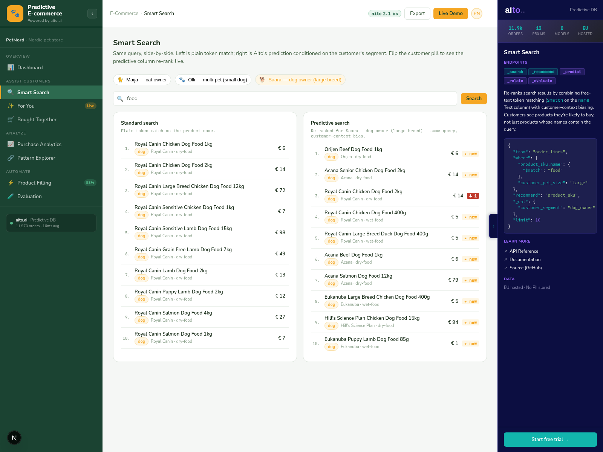

# Smart Search — predictive re-ranking



*Side-by-side standard `_search` vs. predictive `_recommend` for
the same query string. Switch the persona pill (Maija → Olli →
Saara) and the right column flips entirely — same query, different
`where` + `goal`, three personas, three different "top food
results".*

## Overview

The standard e-commerce search box returns "products whose name
contains the query". That's right when the catalog is small and
the customer is anonymous — and wrong the moment either of those
breaks. A large-breed dog owner typing "food" doesn't want cat
food at rank 1; they want dog food at rank 1, even though "cat
food" matches the query string just as well.

Smart Search runs two queries side-by-side and renders the
delta. The left column is honest baseline — plain token match on
the product name. The right column is a `_recommend` that uses
the customer's persona context (segment, pet size) to rank
products by P(this customer would buy it | name contains "food").

This is the demo's headline moment. Done right, it sells the
whole demo: switching the persona pill flips the entire grid live
in <300 ms, and the Aito panel shows the exact `_recommend` body
that produced the new order.

## How it works

### Baseline — plain `_search`

```python
# src/search_service.py — _baseline_search()
client.search(
    table="products",
    where={"name": {"$match": query}},
    limit=10,
)
```

`$match` is required for Text columns (`name` is Text). `$has` and
plain equality only work on Strings. The result is an order-of-
indexing list — Aito's `_search` doesn't rank by relevance unless
you ask it to.

### Predictive — `_recommend product_sku`

```python
# src/search_service.py — _predictive_recommend()
where = {"product_sku.name": {"$match": query}}
if persona.pet_size is not None:
    where["customer_pet_size"] = persona.pet_size

body = {
    "from": "order_lines",
    "where": where,
    "recommend": "product_sku",
    "goal": {"customer_segment": persona.segment},
    "limit": 10,
}

client.recommend(
    table="order_lines",
    where=where,
    recommend_field="product_sku",
    goal={"customer_segment": persona.segment},
    limit=10,
)
```

Reading this query line by line:

- `from: order_lines` — every observation is one order line. Aito
  conditions probabilities on rows that match `where`.
- `where: {product_sku.name: {$match: query}}` — name-match via
  the order_line's link to the product. The Text-column `$match`
  rule still applies; the `.` syntax traverses the link.
- `where: {customer_pet_size: ...}` — when present, narrows the
  conditioning to lines bought by that pet-size cohort.
- `recommend: product_sku` — return distinct product SKUs ranked
  by P(`goal` | `product_sku = X`).
- `goal: {customer_segment: persona.segment}` — the lift target.
  "Of the rows where this product was bought, what share were
  bought by this customer segment?"

That `where` / `goal` split is load-bearing. See the gotchas
section below.

### The delta — what flips between columns

For every product in the predictive column, the frontend renders
a chip with the rank delta vs. the baseline:

```python
# src/search_service.py — _annotate_with_delta()
def _annotate_with_delta(predictive, baseline):
    baseline_rank = {h.sku: h.rank for h in baseline}
    out = []
    for hit in predictive:
        prev = baseline_rank.get(hit.sku)
        if prev is None:
            out.append(HitWithDelta(**asdict(hit), delta_rank=None, new_entry=True))
        else:
            out.append(HitWithDelta(
                **asdict(hit),
                delta_rank=hit.rank - prev,   # negative = moved up
                new_entry=False,
            ))
    return out
```

A chip showing "↑ 4" means the SKU jumped from rank 5 to rank 1.
"NEW" means the SKU wasn't in the baseline top-10 at all but
landed in the predictive top-10 — a product the customer would
buy that didn't even show up under plain name match.

## Key features

### 1. Persona context, not personalised-by-customer-id

The three personas — Maija (cat owner), Olli (multi-pet small dog),
Saara (large breed dog) — are *segment* contexts, not individual
customer histories. The `goal` uses `{customer_segment: ...}`,
not `{customer_id: ...}`. On a 3,000-customer dataset, per-
customer conditioning under-fits; segment conditioning produces
the cleanest visible flip.

### 2. Same query body, three personas, three orderings

The Aito panel on the right shows the live `_recommend` body
verbatim. Click between Maija / Olli / Saara and only the `where`
+ `goal` values change — the query shape stays identical.

### 3. The baseline isn't strawmanned

The baseline column is real `_search` against the same Aito DB,
not a separately-mocked "this is what bad looks like" list. If
the predictive column doesn't beat it on a query, that shows up
as no rank deltas — and we leave that visible in the demo for
queries where it happens.

## Data schema

Smart Search reads `order_lines` (the conditioning surface) and
traverses the `product_sku` link out to `products` for the
name-match:

```json
{
  "products": {
    "type": "table",
    "columns": {
      "sku":       { "type": "String" },
      "name":      { "type": "Text", "analyzer": "whitespace" },
      "pet_type":  { "type": "String" },
      "brand":     { "type": "String" }
    }
  },
  "order_lines": {
    "type": "table",
    "columns": {
      "product_sku":         { "type": "String", "link": "products.sku" },
      "customer_segment":    { "type": "String" },
      "customer_pet_size":   { "type": "String" }
    }
  }
}
```

`customer_segment` and `customer_pet_size` are denormalised onto
`order_lines` so the conditioning happens in a single hop. ADR 0007
documents the alternative (two-hop traversal via
`order_lines → orders → customers`) and why we rejected it (returns
400 from Aito's `_recommend` endpoint).

## Tradeoffs and gotchas

- **Multi-field `goal` doesn't AND**. `goal: {customer_segment,
  customer_pet_size}` for Olli (`dog_owner` + `small`) returns the
  same cat-heavy result as `goal: {customer_pet_size: small}`
  alone, because `pet_size=small` is shared between small dog
  owners and small multi-pet households (which lean cat in our
  fixture). Aito's combined-goal ranking collapses to the dominant
  feature. **Fix**: put one constraint in `where`, the other in
  `goal`. We put `pet_size` in `where`, `segment` in `goal` — see
  `docs/aito-cheatsheet.md`.
- **Hyphen tokenisation on Text fields**. `name: {$match: "dry-food"}`
  searches for the *tokens* `dry` and `food` separately because
  the whitespace analyzer splits on hyphens. For categories we
  strip hyphens at fixture-gen (`dryfood`); for product names
  with hyphenated terms (`"Acana Large-Breed Adult"`) the user
  picks up both tokens, which is usually what they want.
- **The rank delta arrow doesn't show "by how much" in
  probability**. We render rank-delta only because the predictive
  column is ranked, not scored, in this UI. The Aito `$p` is
  available on every hit; a real product would surface it as a
  confidence pill on each tile.
- **The persona pill bar persists in `localStorage`** so the demo
  remembers your last persona. That's not a real-product feature;
  in production the customer context comes from session auth, not
  a manual pill.

## What this demo abstracts away

- **Authenticated per-customer search**. Real e-commerce wires
  the active customer's ID into every search call; we use
  segment pills to make the flip visible in a single screenshot.
- **Query suggestion / typeahead**. The search box is a plain
  text input. A real predictive search would also suggest queries
  (`_recommend` over a `search_log` table — same pattern as
  recommendations).
- **Result-set diversity rules**. Both columns can return all-
  dog or all-cat results in a row; production wants category
  spreading rules on top of the ranker.

## Try it live

[**Open Smart Search**](http://localhost:8500/smart-search/) and
type "food", "treats", or "litter". Click the persona pills above
the columns — the predictive column re-renders in <300 ms.

```bash
./do dev
# → http://localhost:8500/smart-search/
```
