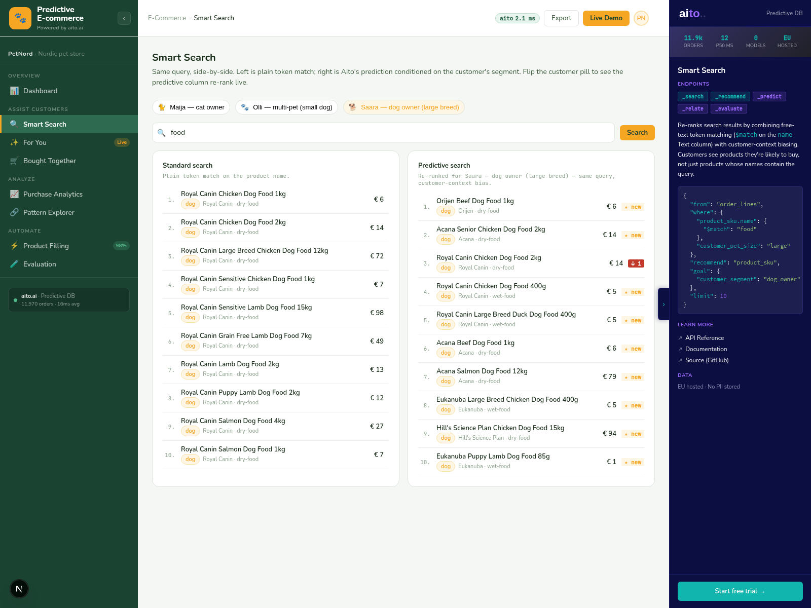

# Smart Search — purchase probability × text relevance



*Side by side for the same query: text relevance (BM25) on the left,
and on the right one `_search` that ranks every product by how likely
this customer is to buy it times how well its name matches. Switch
the persona pill (Maija → Olli → Saara) and the right column flips.*

## Overview

A search box that returns "products whose name contains the query"
fails two ways. It's blind to the customer: a large-breed dog owner
typing "food" gets whatever food ranks first, cat food included. And
it's brittle: require every word in the name and "food for an old
dog" returns nothing, because no product is called that.

Smart Search shows the fix next to the baseline:

- **Left**: BM25 over the product name, a real text ranker with no
  customer context.
- **Right**: purchase probability for this customer context,
  multiplied by the same text relevance, in a single Aito query.

Both columns are measured on a judged query set (`./do search-eval`,
[report](../verification/search-eval.md)). Against the previous
version, which required every query word in the name:

| | nDCG@10 before | after | queries with no results, after |
|:--|--:|--:|--:|
| Left | 0.29 | 0.52 | 30 % |
| Right (per persona) | 0.29 | 0.57-0.59 | 0 % |

## How it works

### Left — BM25 text relevance

```python
# src/search_service.py — _baseline_search()
res = client.search(
    table="products",
    order_by={"$similarity": {"name": query}},
    select=["sku", "name", "brand", "pet_type", "category", "price_eur", "$score"],
    limit=10,
)
matched = [h for h in res["hits"] if h["$score"] > 1.0]
```

`$similarity` is BM25 expressed as a lift, `exp(θ·bm25)`. A product
that matches no query word gets exactly 1.0, and all such products
tie. **Aito returns ties in table order**, and this table starts with
dog dry food. Without the `> 1.0` filter, any query with no matching
word ("hundmat", "canine kibble") would show the first ten dog foods
as if they were results.

### Right — `$p × $similarity` in one `orderBy`

```python
# src/search_service.py — predictive_blend_body()
{
    "from": "impressions",
    "get": "product_sku",
    "where": {"customer_segment": "dog_owner", "customer_pet_size": "large"},
    "orderBy": {"$multiply": [
        {"$p": {"$context": {"purchased": True}}},
        {"$similarity": {"name": query}, "theta": 3.0},
    ]},
    "select": ["sku", "name", "brand", "pet_type", "category", "price_eur"],
    "limit": 10,
}
```

Reading it line by line:

- `from: impressions` — one row per product shown to a shopper, with
  the outcome (`clicked`, `purchased`) and the shopper's segment.
- `get: product_sku` — rank the *products* those rows link to, not
  the rows themselves. Every product in the catalogue is a candidate.
- `where` — the customer context to condition on.
- `$p{$context: {purchased: true}}` — P(this context buys the
  product), learned from the funnel.
- `$similarity {name: query}` — BM25 over the product name, as a lift.
- `$multiply` — rank by the product of the two.

### Choosing the text weight (θ)

The two signals trade off through `$similarity`'s `theta`. Aito's
calibrated default (0.33) let purchase history drown the words: a cat
owner typing "food for an old dog" got cat food. On the judged set
(nDCG@10, right column per persona):

| θ | 0.33 | 1.0 | 2.0 | 3.0 |
|:--|--:|--:|--:|--:|
| Maija | 0.31 | 0.50 | 0.54 | 0.59 |
| Olli | 0.31 | 0.48 | 0.54 | 0.57 |
| Saara | 0.32 | 0.53 | 0.58 | 0.59 |

At 2.0, relevance already matched BM25, but a cat owner's "dog food"
still had cat food at ranks 7-10. 3.0 is the smallest weight tried
that keeps pet-specific queries on that pet (pinned in
`tests/test_aito_check.py`) while ambiguous queries like "food" are
still decided by the customer. θ was chosen on the same query set it
is reported on. Re-choosing it on half the queries picks 3.0 in all
500 stratified splits, so the choice itself is stable.

### When no word matches

If no product name contains any query word ("dogfood" as one word),
every `$similarity` is 1.0 and the right column ranks on purchase
probability alone: what this customer usually buys. That's a
reasonable fallback, but it isn't a text match, so the response
carries `text_matched: false` and the page says so above the column.

### The delta — what flips between columns

Each product in the right column carries its rank change against the
left. "↑ 4" means it moved from rank 5 to rank 1. A ★ means it wasn't
in the left column's top 10 at all.

## Key features

### 1. Persona context, not per-customer history

Maija (cat owner), Olli (small dog) and Saara (large-breed dog) are
*segment* contexts in `where`, not individual customer ids. On 3,000
synthetic customers, per-customer conditioning under-fits; segment
conditioning gives the clean, visible flip.

### 2. One query shape, three personas

The Aito panel shows the body the right column actually sent. Between
personas only the `where` values change.

### 3. The baseline isn't a strawman

The left column is a real text ranker against the same database, and
it's a strong one (nDCG@10 0.52 against the old 0.29). The right
column is measured against it. In-sample it's ahead for every persona.
Because θ was tuned on the same queries, the report also repeats the
choice out of sample: the held-out gain is small (median +0.06) and
positive in every split, but 30 held-out queries are too few to prove
it per persona. Honestly stated: at least as good as BM25, probably
slightly better.

## Tradeoffs and gotchas

- **`$p` in `select` is not a probability here.** With `$multiply` in
  the `orderBy`, the selected `$p` is the product of the lifts (values
  well above 1). It isn't selected, so it can't be misread as a
  percentage.
- **Meaning isn't matched yet.** "old" doesn't match "Senior", and
  Finnish/Swedish queries match no English name. Those rank on
  purchase probability alone (nDCG@10 ~0.2 on Nordic queries, near
  chance). Step 2 of ADR 0026 adds multilingual vector similarity as
  a third `$multiply` factor.
- **Hyphen tokenisation on Text fields.** BM25 tokenises
  `"Large-Breed"` into `large` and `breed`, which is usually what a
  shopper wants.
- **The persona pill bar persists in `localStorage`** so the demo
  remembers your last persona. In production the customer context
  comes from the session.

## What this demo abstracts away

- **Authenticated per-customer search.** Real e-commerce wires the
  active customer into every search call; the demo uses segment pills
  to make the flip visible in one screenshot.
- **Query suggestion / typeahead.**
- **Result-set diversity rules.** Production would spread categories
  on top of the ranker.

## Try it live

[**Open Smart Search**](http://localhost:8500/smart-search/) and type
"food", then "food for an old dog". Click the persona pills above the
columns.

```bash
./do dev
# → http://localhost:8500/smart-search/
```
