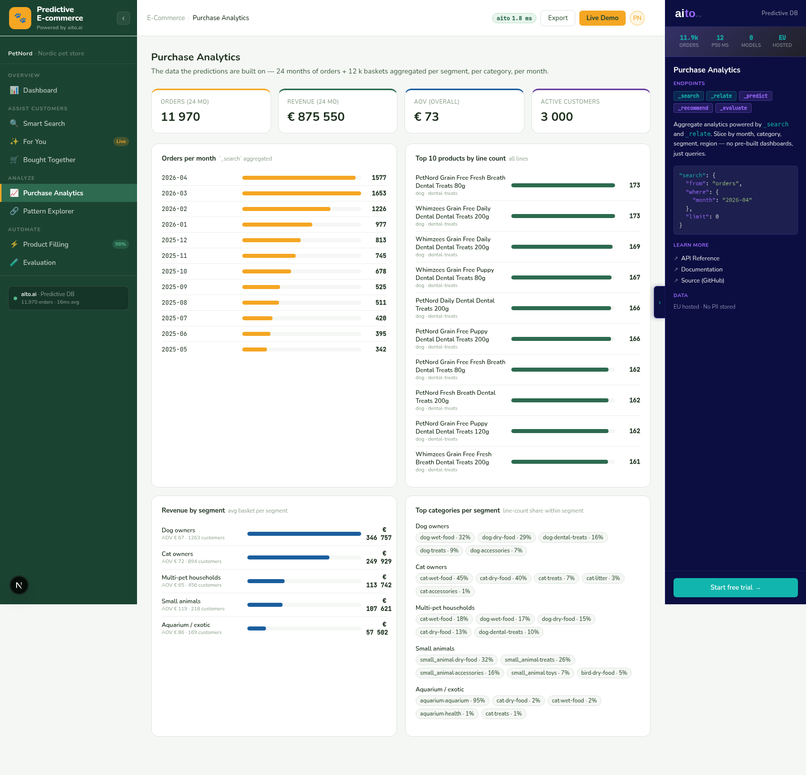

# Purchase Analytics — the data behind the predictions



*The "show the numbers behind every prediction" view. Monthly
orders + revenue (24-month window), top 10 SKUs by line count,
per-segment KPIs (customers, orders, revenue, AOV), and the
per-segment category mix. All `_search`-driven; nothing
precomputed.*

## Overview

Every other view in this demo *predicts*. Purchase Analytics
*reports*. It's the surface that lets a CTO sanity-check the
predictions: "if dog dry-food → dental treats lift is 2.72×, the
underlying volumes should make that plausible". Purchase Analytics
shows those volumes.

The view doesn't introduce any new Aito mechanics. It reuses
`_search limit=0` for counts and pages the full data set
(~14,000 orders, ~36,000 lines) with `_search` + `offset`, then
aggregates client-side. Aito's `_search` is the right primitive
for this — it's fast, paged, and gives you raw rows back without
any prediction overhead.

## How it works

### Monthly orders + revenue

```python
# src/analytics_service.py — _monthly_orders()
monthly_counts = Counter()
monthly_revenue = defaultdict(float)
offset = 0
page = 5000
while True:
    res = client.search("orders", limit=page, offset=offset)
    hits = res.get("hits", [])
    if not hits:
        break
    for o in hits:
        m = o.get("month", "")
        monthly_counts[m] += 1
        monthly_revenue[m] += float(o.get("total_eur", 0))
    if len(hits) < page:
        break
    offset += page
```

Two pages cover the full orders table (~14k rows / 5k page).
Aggregation by `month` happens in Python — Aito doesn't expose
SUM/GROUP BY in `_search`. The aggregation is cheap relative to
the network round-trip.

### Top 10 SKUs by line count

Same pattern over `order_lines` — page through, count `product_sku`
appearances, take the top 10:

```python
counts = Counter()
offset = 0
while True:
    res = client.search("order_lines", limit=5000, offset=offset)
    hits = res.get("hits", [])
    if not hits:
        break
    for ln in hits:
        counts[ln.get("product_sku", "")] += 1
    if len(hits) < 5000:
        break
    offset += 5000

top_skus = counts.most_common(10)
```

The `_search` here is unindexed — no `where`, no order. Aito
returns rows in whatever order suits its index; we don't care
about order, we count. Eight pages cover ~36k lines.

### Per-segment KPIs

Three passes — customers, orders, lines — joined client-side:

```python
# Build customer_id → segment map
customers_by_id = { c["customer_id"]: c for c in pages_of(client, "customers") }

# Orders → segment via customer
seg_orders = Counter()
seg_revenue = defaultdict(float)
order_to_segment = {}
for o in pages_of(client, "orders"):
    cust = customers_by_id.get(o["customer_id"])
    if not cust: continue
    seg = cust.get("segment", "")
    seg_orders[seg] += 1
    seg_revenue[seg] += float(o.get("total_eur", 0))
    order_to_segment[o["order_id"]] = seg

# Lines → segment × (pet_type, category) for the mix
seg_cat_counts = defaultdict(Counter)
for ln in pages_of(client, "order_lines"):
    seg = order_to_segment.get(ln["order_id"])
    if not seg: continue
    prod = products.get(ln["product_sku"])
    if not prod: continue
    seg_cat_counts[seg][(prod["pet_type"], prod["category"])] += 1
```

This produces the segments table at the top of the view + the
"category mix" stacked rows below it.

## Key features

### 1. Same data Aito ranks on

The numbers in this view aren't computed from a separate analytics
warehouse. They're aggregated off the same `orders` /
`order_lines` rows Aito's `_predict` / `_recommend` / `_relate`
read from. If the dashboard says "10,156 orders in the last 12
months" and analytics says "10,156 across 24 months", that's
because analytics covers the full window, not because the two
views ran against different snapshots.

### 2. No SQL, just `_search` pages

Aito's `_search` with `offset` pagination is the only API in
play. No GROUP BY, no SUM, no SQL-like query layer — `_search`
returns rows, Python folds them. For 14k orders this is fast
enough; at 14M orders you'd want a real OLAP store next to Aito,
not this view.

### 3. Per-segment category mix surfaces predictive context

The category-mix block at the bottom is the data Aito uses to
make For You / Smart Search recommendations work. Looking at
"Dog owners: 38% dry-food, 22% dental-treats, 16% treats, 11%
accessories, 7% wet-food, 5% toys" tells you *why* For You for
Saara puts dry-food at the top: that segment buys it most.

The view doesn't draw that link explicitly — it's implicit. A
reviewer wanting "why does Aito recommend X" can read it off the
mix block.

## Data schema

Three tables — customers, orders, order_lines — joined client-side
via `customer_id` and `order_id`:

```json
{
  "customers":   { "columns": { "customer_id", "segment", "pet_size", ... } },
  "orders":      { "columns": { "order_id", "customer_id", "month", "total_eur", ... } },
  "order_lines": { "columns": { "order_id", "product_sku", ... } }
}
```

`customers.segment` is the link to the segment cards. `orders.month`
is `"YYYY-MM"` (lexicographically sortable) so the time-axis
sort is trivial. `order_lines.product_sku` joins out to
`products` for the SKU names in the top-10 list.

## Tradeoffs and gotchas

- **Three sequential paging loops**. Customers, orders, lines —
  each a separate page-through. We could parallelise with
  `ThreadPoolExecutor`; we don't because the view caches for 30
  minutes and the cold-load is ~3 s which is acceptable for an
  analytics page. Production wants parallelisation here.
- **Aggregation is client-side**. Aito doesn't sum the
  `total_eur` for us. For 14k rows that's fine; at 100k+ rows
  the JSON parsing alone becomes the bottleneck and you'd want
  pre-aggregated tables.
- **No date arithmetic**. Aito stores `month` as `"YYYY-MM"`;
  we sort lexicographically. Day-level breakdowns would require
  a `day` column (we don't have one).
- **The category-mix row doesn't normalize across segments**.
  Each segment's row sums to 100% of *its own* lines. That's
  the right shape for "what does this segment buy"; it's the
  wrong shape for "which segment dominates this category".
  Pattern Explorer handles the latter (with lift, not share).

## What this demo abstracts away

- **Time-range pickers**. The view is fixed to the full 24-month
  window. Production would slice arbitrary ranges.
- **Drill-down from any cell**. Clicking a month bar or a
  segment row doesn't open a filtered list. Same constraint as
  the Dashboard — Pattern Explorer is the only drill-down
  surface in the demo.
- **Real OLAP**. For 100k+ orders you want a columnar store
  next to Aito (e.g. ClickHouse, DuckDB, BigQuery). Aito is the
  prediction layer; analytics at scale lives elsewhere.

## Try it live

[**Open Purchase Analytics**](http://localhost:8500/purchase-analytics/) —
the full table loads in ~3 s cold, ~50 ms warm.

```bash
./do dev
# → http://localhost:8500/purchase-analytics/
```
