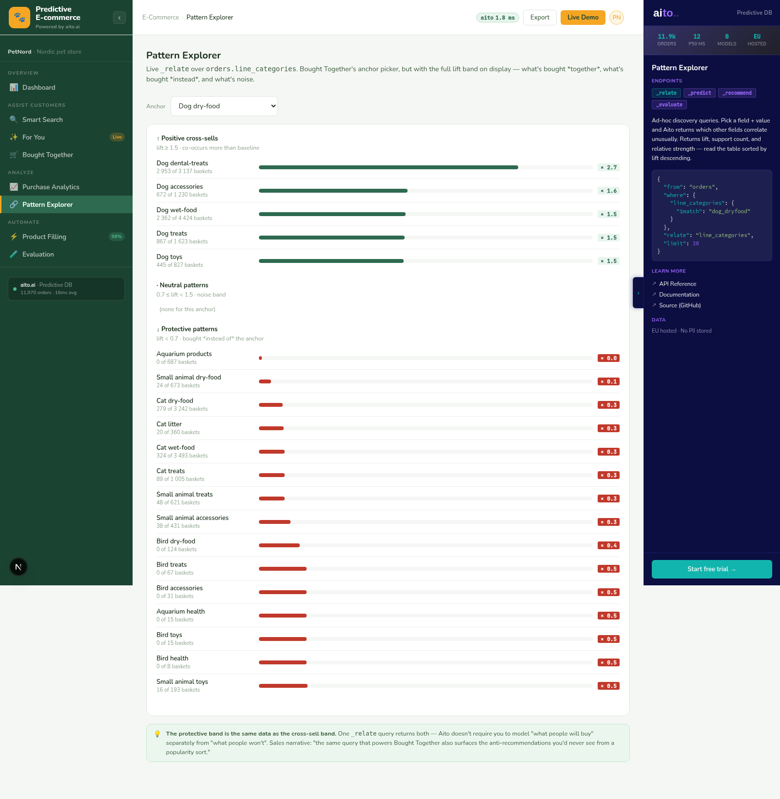

# Pattern Explorer — the full lift band



*Same `_relate` body Bought Together uses, but the filter comes
off. Surfaces the **full lift band** — positive (lift > 1.5),
neutral, and protective (lift < 0.7) patterns — so reviewers can
see what's bought together AND what's bought instead.*

## Overview

Bought Together filters out everything below lift 1.2 because the
view's job is cross-sell — and cross-selling on negative lift is
worse than cross-selling at random. But the negative lifts are
interesting data; they tell you which products are *substitutes*
("customers who buy wet food rarely buy dry food") rather than
complements.

Pattern Explorer surfaces those. Same Aito query as Bought
Together, no lift filter, and the rows are sorted by *absolute
distance from 1.0* — so the strongest positive AND the strongest
protective patterns both rise to the top. The frontend renders the
result with three chip styles: green for positive, grey for
neutral, red for protective.

## How it works

### The query

Identical to Bought Together. The only differences are higher
`limit` (30 instead of 12) and no lift cut-off in the service:

```python
# src/pattern_service.py — get_patterns()
body = {
    "from": "orders",
    "where": {"line_categories": {"$match": anchor_id}},
    "relate": "line_categories",
    "limit": 30,
}

client.relate(
    table="orders",
    where=body["where"],
    relate_field="line_categories",
    limit=30,
)
```

### Reading every field Aito returns

Pattern Explorer surfaces three numbers per row that Bought
Together collapses into one "lift × support" chip:

```python
patterns.append(Pattern(
    label=_humanise(target_pet, target_cat),
    token=token,
    lift=round(lift, 2),
    support={
        "f":              int(fs.get("f", 0)),
        "f_on_condition": int(fs.get("fOnCondition", 0)),
    },
    p_given=round(float(ps.get("pOnCondition", 0)), 4),
    p_overall=round(float(ps.get("p", 0)), 4),
    band=_band(lift),
))
```

- `lift` — the headline number.
- `f` — total orders that contain the target token.
- `f_on_condition` — orders that contain BOTH the anchor and the
  target token.
- `p_given` — P(target | anchor).
- `p_overall` — P(target) across all orders.

The "% co-buy" column shows `p_given × 100`; the "% baseline"
column shows `p_overall × 100`. Lift = p_given / p_overall, which
makes the math visible on the same row.

### Band classification

```python
def _band(lift: float) -> str:
    if lift >= 1.5:
        return "positive"
    if lift < 0.7:
        return "protective"
    return "neutral"
```

The thresholds are tuned to the dataset's distribution:
~80% of pairs land in `[0.7, 1.5)` ("neutral"), which the chip
renders in grey at low visual prominence. The reviewer's eye
goes to green and red.

### Sort by deviation, not by lift

```python
patterns.sort(key=lambda p: abs(p.lift - 1.0), reverse=True)
```

Sorting by raw lift ascending shows the protective patterns first;
descending shows the positive patterns first. Sorting by *distance
from 1* surfaces both extremes together — which is the right
ordering for "find the most-non-random pairs", regardless of
direction.

## Key features

### 1. Three visual bands

Green chip = co-occurs more than chance (cross-sell). Grey chip =
roughly independent. Red chip = co-occurs less than chance
(substitution). The chip color encodes lift band without the
reviewer having to read the number.

### 2. Reuses Bought Together's anchor catalog

Same six anchors (dog dry-food, cat wet-food, etc.) and the same
token-decode helpers. If a new anchor lands in Bought Together,
it shows up in Pattern Explorer automatically:

```python
# src/pattern_service.py
from src.bought_together_service import (
    ANCHORS,
    DEFAULT_ANCHOR,
    _humanise,
    _token_to_pair,
)
```

### 3. Same query body, two views

The Aito panel on the right shows the same `_relate` body Bought
Together's panel shows. That's the point — Pattern Explorer
*isn't* a different query, it's the same query with a different
rendering. A reviewer comparing the two views sees identical
JSON.

## Data schema

Same as Bought Together — the denormalised
`orders.line_categories` Text column with `analyzer: whitespace`.
See [04-bought-together.md](04-bought-together.md) for the
schema rationale.

## Tradeoffs and gotchas

- **Sorting by `abs(lift - 1.0)` hides "interestingly mild"
  patterns**. A row at lift 1.05 with 800 supporting orders is
  more reliable evidence than a row at lift 5× with 3 supporting
  orders. The view shows both via the support column; a
  production version would weight by `f_on_condition` in the sort
  key.
- **The protective-band threshold of 0.7 is dataset-specific**.
  We picked it because most pairs cluster between 0.85 and 1.15;
  below 0.7 reliably means "actively avoided together". On a
  different catalog the threshold needs re-tuning.
- **`p_overall` is the marginal across all orders, not the
  marginal in the matching segment**. For "dog dry-food → cat
  litter at lift 0.05", that's the right reading ("any random
  order is more likely to have cat litter than a dog-food order
  is"). A per-segment baseline would require an extra `_search`
  for the segment's baseline rate.
- **Pattern Explorer doesn't paginate**. The 20-row cap is in
  the service. Production would let the user request page 2;
  `_relate` accepts `offset` like `_search`.

## What this demo abstracts away

- **User-driven where + relate**. The anchor picker is constrained
  to the 6 curated pairs. A real "Pattern Explorer" would let the
  user pick any two fields and run `_relate` ad-hoc — the back-
  end shape supports it, the UI doesn't expose it.
- **Statistical significance**. The view shows `lift` + `f` but
  no p-value or confidence interval. Lift 3.0× with f=5 is noise;
  lift 1.4× with f=2000 is real. Production wants a significance
  column.
- **Pattern history / drift**. "Lift was 2.7× last quarter, now
  1.9×" is a useful signal for category managers. The view is
  point-in-time; production wants a trend line.

## Try it live

[**Open Pattern Explorer**](http://localhost:8500/pattern-explorer/)
and click between anchors. The full lift band (typically 15-20
patterns per anchor) loads in ~250 ms.

```bash
./do dev
# → http://localhost:8500/pattern-explorer/
```
