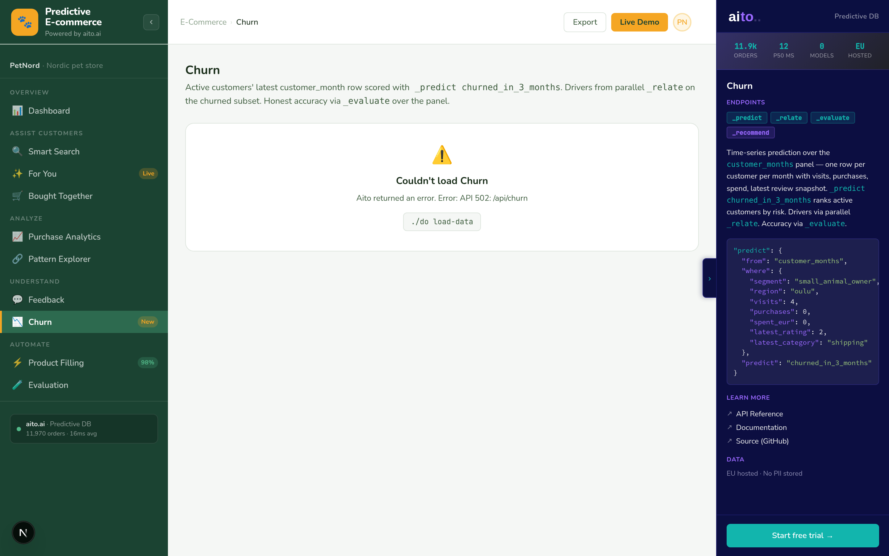

# Churn — the killer Understand view



*Time-series prediction over a panel of customer-months. Each
active customer's latest row — carrying this-month visits,
purchases, spend, denormalised profile, and the latest review
snapshot — gets scored by `_predict churned_in_3_months`.
Parallel `_relate` calls surface the drivers (segment, region,
latest review category / sentiment). `_evaluate` reports
held-out accuracy.*

## Overview

Churn prediction is the single most economically-relevant model
an e-commerce shop can run. Most shops do this with a rule-of-
thumb table ("anyone who hasn't ordered in 90 days is at risk")
exported nightly to the email tool. That's not prediction;
that's a calendar.

Real churn prediction asks: *given a customer's segment, region,
tenure, basket size, total spend — who's about to stop buying
even though they were active recently?* Aito's `_predict
churned` answers that per row, without the analyst writing any
feature-engineering pipeline.

This view is the demo's strongest "Aito gives you something a
SQL query can't" moment. Four blocks: KPI strip, at-risk
leaderboard, drivers, evaluation.

## How it works

### Block 1: KPI counts

Three `_search limit=0` calls:

```python
total    = client.search("customers", limit=0)["total"]
churned  = client.search("customers", where={"churned": True}, limit=0)["total"]
active   = total - churned
```

Total / Active / Churned / churn-rate render as four cards
across the top. Cheap — ~30 ms total.

### Block 2: At-risk leaderboard

First, pull every active customer's *latest* customer_month row
at the cutoff month:

```python
# src/churn_service.py — _at_risk_leaderboard()
sample = client.search(
    "customer_months",
    where={"month": "2026-04", "churned_in_3_months": False},
    limit=120,
)["hits"]
```

Then, one `_predict` per row:

```python
res = client.predict(
    table="customer_months",
    where={
        "segment":                row["segment"],
        "region":                 row["region"],
        "pet_size":               row.get("pet_size"),    # nullable
        "tenure_months_at_month": row["tenure_months_at_month"],
        "visits":                 row["visits"],
        "purchases":              row["purchases"],
        "spent_eur":              row["spent_eur"],
        "latest_rating":          row.get("latest_rating"),
        "latest_sentiment":       row.get("latest_sentiment"),
        "latest_category":        row.get("latest_category"),
    },
    predict_field="churned_in_3_months",
    limit=2,
)
for hit in res.get("hits", []):
    if hit.get("feature") is True:
        return float(hit.get("$p", 0))
```

100 calls run in a thread pool (8 workers). Sort by
P(churned_in_3_months=true) descending, take the top 20.

**Why the panel shape**: the features Aito conditions on are
*this month's behaviour* — visits, purchases, spend, latest
review — not aggregates over the customer's lifetime. That's the
difference between a calendar-style rule ("hasn't ordered in 90
d") and a real classifier ("visits dropped 60%, last review was
a 2-star shipping complaint, segment is small_animal_owner — 78%
churn risk").

### Block 3: Drivers — five parallel `_relate` calls

```python
# src/churn_service.py — _drivers()
relate_fields = [
    "segment", "region", "pet_size",
    "latest_category", "latest_sentiment",
]

def fetch(field):
    return field, client.relate(
        table="customer_months",
        where={"churned_in_3_months": True},
        relate_field=field,
        limit=12,
    )

with ThreadPoolExecutor(max_workers=5) as pool:
    results = list(pool.map(fetch, relate_fields))
```

Each `_relate` returns lift per value of that field over the
churned-row subset. For example:

```
segment=small_animal_owner   → lift 1.7× (drives churn)
region=oulu                  → lift 1.5×
latest_sentiment=negative    → lift 2.4× (feedback↔churn signal)
latest_category=shipping     → lift 1.9×
pet_size=large               → lift 0.7× (mild protective)
```

The two `latest_*` rows are the key new signal — they connect
feedback to churn. A customer whose last review was negative is
~2.4× more likely to be in the churned subset.

Filtered to |lift - 1| ≥ 0.15, sorted by |lift - 1| descending,
top 10. Red chips for `lift > 1`, green for `lift < 1`.

### Block 4: Honest accuracy via `_evaluate`

```python
# src/churn_service.py — _evaluate_churn()
where = {
    "segment":                {"$get": "segment"},
    "region":                 {"$get": "region"},
    "tenure_months_at_month": {"$get": "tenure_months_at_month"},
    "visits":                 {"$get": "visits"},
    "purchases":              {"$get": "purchases"},
    "spent_eur":              {"$get": "spent_eur"},
}
client.evaluate(
    table="customer_months",
    where=where,
    predict_field="churned_in_3_months",
    test_limit=300,
)
```

`$get` reads each held-out row's value at evaluation time —
without it `_evaluate` would predict the same fixed input 300
times. Returns accuracy + baseAccuracy + n; the view computes
`accuracy_gain_pp = (accuracy - baseAccuracy) × 100` and
renders pass/fail.

Sample size is 300 rows — bigger than the 200 used by the
Evaluation view because the panel has 26,500 rows total (vs
3,000 customers), so the held-out sample needs to be larger to
read a stable accuracy.

## Key features

### 1. The timestamp held out, deliberately

The churn label is `last_order_month ≤ 2026-01`. If `_predict`
sees `last_order_month` it reads the label off the same column.
The view excludes it from `where` so Aito predicts from "who
they are" not "when they last bought".

This is the technique to use any time the label is derived from
a column the row carries — exclude the source from the
conditioning, predict from the everything-else.

### 2. Parallel scoring across N customers

100 parallel `_predict` calls in a 8-worker thread pool. Wall-
time ~2 s warm. The right pattern for "score every row in a
table" — production with 2,000 active customers would precompute
once a day rather than per page-load.

### 3. Same `where` shape across predict + evaluate

The features in the leaderboard's `_predict` are byte-identical
to the features in `_evaluate`. That's by design: the accuracy
number you see on the right is the accuracy of the left-side
ranking.

### 4. Drivers + accuracy together

The drivers section answers "why" — which segments / regions /
pet sizes correlate with churn. The accuracy section answers
"how well does Aito predict on held-out data". A reviewer
reading both together gets the full picture: *Aito predicts
at X% accuracy, and the dominant features are these.*

## Data schema

The view reads from two tables: `customers` (for KPI counts) and
`customer_months` (for the per-row prediction).

```json
{
  "customer_months": {
    "type": "table",
    "columns": {
      "customer_month_id":      { "type": "String" },
      "customer_id":            { "type": "String", "link": "customers.customer_id" },
      "month":                  { "type": "String" },
      "visits":                 { "type": "Int" },
      "purchases":              { "type": "Int" },
      "spent_eur":              { "type": "Decimal" },
      "segment":                { "type": "String" },
      "pet_size":               { "type": "String", "nullable": true },
      "region":                 { "type": "String" },
      "tenure_months_at_month": { "type": "Int" },
      "latest_rating":          { "type": "Int",    "nullable": true },
      "latest_sentiment":       { "type": "String", "nullable": true },
      "latest_category":        { "type": "String", "nullable": true },
      "churned_in_3_months":    { "type": "Boolean" }
    }
  }
}
```

~26,500 rows (3,000 customers × ~9 months avg). The
`churned_in_3_months` label is **forward-looking**: True iff the
customer is currently churned AND the row's month is at or after
their last order month. For active customers, every row is False;
for churned customers, the label flips True at the last-order
month. Aito learns the transition pattern.

`visits` is synthesized — base rate per segment × decay factor
for churning customers + Gaussian noise. The decay drops visits
to ~30% in the last-order month and ~4% thereafter, giving Aito
a strong leading-indicator signal.

The churn signal originates in `data/generate_fixtures.py` with
`_churn_propensity(customer, n_orders)` — segment + region +
tenure + low-orders weights — keyed on a sub-RNG seeded from
`customer_id` so the existing demo signals (dog-food→dental
lift, persona overlaps) stay byte-identical. Personas are never
churned.

## Tradeoffs and gotchas

- **`last_order_month` is the strongest possible feature, and we
  don't use it**. Including it makes `_predict` trivial (100%
  accuracy). Excluding it forces Aito to learn from the structural
  features, which is the genuinely-useful prediction. A real
  product would offer both: "predict churn from features alone"
  (proactive scoring) and "predict churn from features + recency"
  (validation).
- **`_predict` of a Boolean returns true / false as hits**. The
  service walks the hit list looking for `feature: true` and
  reads its `$p`. Don't assume the first hit is the answer —
  Aito may return `false` first if the baseline favours it.
- **`pet_size` is nullable**. cat_owner and aquarium_owner rows
  don't have a pet_size. `_predict` errors on `where:
  {pet_size: null}`, so the service drops the key when the
  value is null.
- **100 parallel `_predict` calls is the costliest page**.
  Mitigated by the 30-minute cache. Production scoring should
  precompute once per night rather than per-page-load.
- **`_relate` over `pet_size` only covers the segments that have
  one**. The result is "of pet_size=large customers, what's the
  churn rate", which is over-indexed on dog_owner + multi_pet.
  This is the right shape for the demo — the alternative would
  be three separate calls per (segment, pet_size) combination.

## What this demo abstracts away

- **Per-customer retention recommendation**. "Offer this
  customer 20% off cat food." That's `_recommend` from the
  per-customer feature row with `goal: {churned: false}`. A
  natural follow-up; not in this PR.
- **Cohort retention curves**. Monthly cohort decay over time.
  Purchase Analytics or a new view is the right surface.
- **Configurable churn windows**. The 90-day cutoff is
  hardcoded. Production would expose it as a parameter.
- **Multi-class churn states**. Active / lapsing / churned /
  reactivated. The label is binary here.

## Try it live

[**Open Churn**](http://localhost:8500/churn/). Cold load is
~5 s (100 parallel predicts + 3 relates + 1 evaluate); cache
for 30 minutes after.

```bash
./do dev
# → http://localhost:8500/churn/
```

Watch the at-risk leaderboard: high-confidence rows (red chip)
tend to cluster on `small_animal_owner` + `oulu` + low total
orders — the drivers section on the right makes the pattern
explicit.
