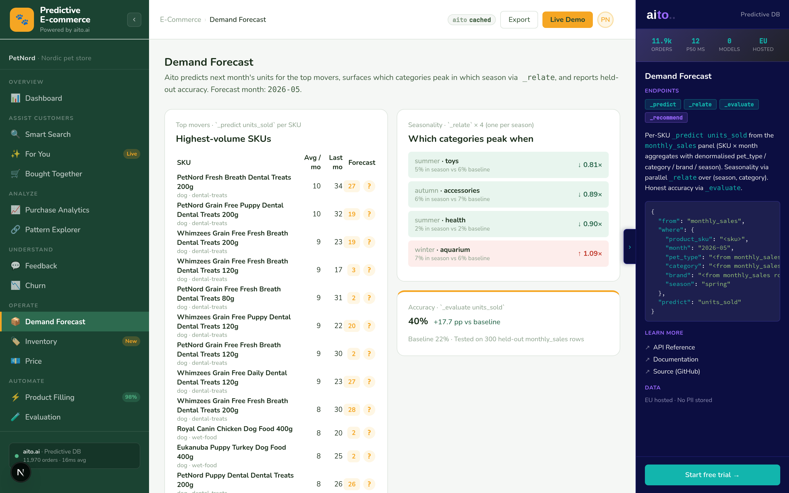

# Demand Forecast — `_predict units_sold` over a panel



*Per-SKU next-month units forecast via `_predict units_sold` from
the `monthly_sales` panel (SKU × month aggregates). Seasonality
via four parallel `_relate` calls per season. Held-out accuracy
via one `_evaluate`.*

## Overview

Forecasting next month's units is the merchandiser's daily
question — it drives reorder volumes, ad spend, and promotional
calendars. The same `_predict` pattern Aito uses for category
classification also works for integer regression (`units_sold`
is an Int column).

The view shows the 25 top-volume SKUs, predicts each one's
next-month units in parallel, and surfaces the `$why`
decomposition per row.

## How it works

### The query

```python
# src/demand_service.py — _predict_units()
where = {
    "product_sku": sku,
    "month":       "2026-05",        # next month
    "pet_type":    "dog",            # from monthly_sales row
    "category":    "dry-food",       # denormalised
    "brand":       "Royal Canin",
    "season":      "spring",         # derived from month
}
res = client.predict("monthly_sales", where=where,
                     predict_field="units_sold", limit=3)
```

`pet_type` / `category` / `brand` are denormalised onto every
`monthly_sales` row at fixture-gen time so `_predict` conditions
on them in one hop. `season` is computed via the
`_SEASON_BY_MONTH` map and stored on each row — this lets Aito
generalise across months that share a season.

### Parallel fan-out

```python
with ThreadPoolExecutor(max_workers=8) as pool:
    scored = list(pool.map(predict_one, sku_stats))
```

25 SKUs × ~50 ms / predict = ~3 s wall-clock cold, instant warm
(30-min cache).

### Seasonality `_relate`

```python
def fetch(season):
    return client.relate(
        table="monthly_sales",
        where={"season": season},
        relate_field="category",
        limit=8,
    )

with ThreadPoolExecutor(max_workers=4) as pool:
    results = list(pool.map(fetch, ["spring", "summer", "autumn", "winter"]))
```

Four parallel `_relate` calls, one per season. Each returns
categories that over-index in that season. Lifts > 1.5 surface
as positive drivers ("dental treats lift 1.8× in winter"); lifts
< 0.7 as protective.

### Honest accuracy

```python
client.evaluate(
    table="monthly_sales",
    where={
        "product_sku": {"$get": "product_sku"},
        "month":       {"$get": "month"},
        "pet_type":    {"$get": "pet_type"},
        "category":    {"$get": "category"},
        "brand":       {"$get": "brand"},
        "season":      {"$get": "season"},
    },
    predict_field="units_sold",
    test_limit=300,
)
```

Same feature set as the per-row predict, evaluated over 300
held-out monthly_sales rows. The view shows accuracy + baseline
+ gain pp.

## Key features

### 1. `units_sold` is an Int — `_predict` does regression

Each hit returns a specific integer value with its `$p`. The
top hit's `feature` is the predicted number; alternatives carry
the next-most-likely counts. Aito doesn't return a distribution;
it returns the highest-probability value.

### 2. Top-movers only

The page shows 25 SKUs by average monthly units, not every
catalog item. Long-tail SKUs with sparse history return noisy
predictions and dilute the demo's story.

### 3. Same shape Inventory consumes

The Inventory view runs the *same* `_predict units_sold` per
critical SKU to compute revenue-at-risk. Two pages, one query
shape, one cache.

## Data schema

```json
{
  "monthly_sales": {
    "type": "table",
    "columns": {
      "monthly_sale_id":  { "type": "String" },
      "product_sku":      { "type": "String", "link": "products.sku" },
      "month":            { "type": "String" },
      "units_sold":       { "type": "Int" },
      "revenue_eur":      { "type": "Decimal" },
      "unique_customers": { "type": "Int" },
      "pet_type":         { "type": "String" },
      "category":         { "type": "String" },
      "brand":            { "type": "String" },
      "season":           { "type": "String" }
    }
  }
}
```

~11,100 rows = 658 SKUs × ~17 months coverage. Empty
(zero-sales) months are not emitted — they carry no conditioning
signal.

## Tradeoffs and gotchas

- **`units_sold` Int regression is coarser than a real continuous
  forecast.** Aito returns the most-probable integer, not a
  P50/P90 range. Acceptable for an order-of-magnitude planning
  view; not a substitute for stochastic methods.
- **Forecasting a month not in training data**: the `month`
  value `"2026-05"` is novel — Aito relies on the other
  features (sku + denormalised profile + season) for the
  prediction. `season` lets Aito generalise: "this SKU sold N
  in past springs, May is spring, predict N-ish".
- **`limit=3` on the predict**: enough to capture the top hit +
  a couple of alternatives for the `$why` factor display.
  Higher limit costs `_predict` time proportionally.
- **Synthesised baseline accuracy**: `monthly_sales.units_sold`
  is Int with a long tail; the "majority-class" baseline is the
  most-common single value (e.g., 1 unit). Accuracy gain over
  baseline reads modest on its own; the per-row `$why` shows
  Aito picking specific features (brand, season) that matter.

## What this demo abstracts away

- **Confidence intervals**. Single point estimates only.
- **Multi-month horizons**. Forecast is next month only.
- **External events** (promotions, ad campaigns, holidays).

## Try it live

[**Open Demand**](http://localhost:8500/demand/). Cold load ~3-5 s
(25 parallel `_predict` × 1 `_evaluate` × 4 `_relate` calls);
cached for 30 minutes.
