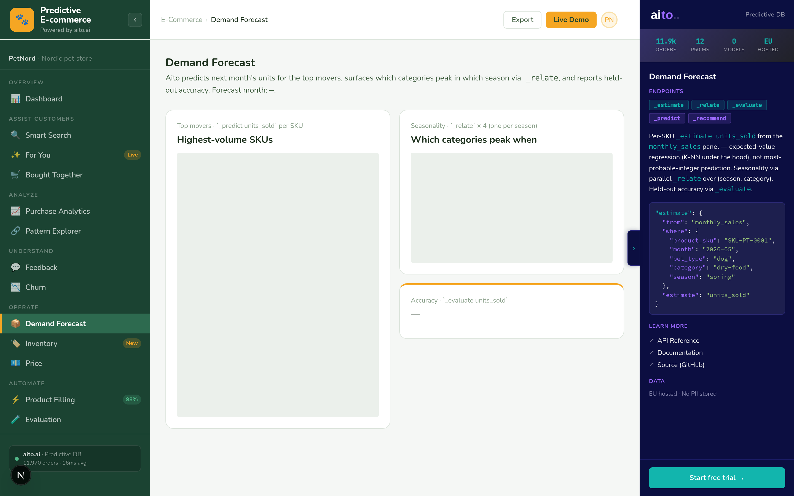

# Demand Forecast — `_estimate units_sold`, judged against naive



*Per-SKU next-month units forecast via `_estimate units_sold` over the
`monthly_sales` panel (SKU × month aggregates). Seasonality via four
parallel `_relate` calls. Accuracy on the latest month, shown next to
the naive "same as last month" forecast.*

## Overview

Forecasting next month's units is the merchandiser's daily question.
It drives reorder volumes, ad spend and promotional calendars. Every
planner already has a rule for it: next month will look like last
month. A forecast is only worth showing if it beats that rule, so the
page shows both.

The view lists the 25 top-volume SKUs, forecasts each one's next-month
units in parallel, and surfaces the `$why` decomposition per row.

## How it works

### The forecast

```python
# src/demand_forecast.py — forecast_units()
where = {
    "product_sku":      sku,
    "units_last_month": 14,            # sales in the latest month; 0 if none
    "pet_type":         "dog",         # denormalised onto monthly_sales
    "category":         "dry-food",
    "brand":            "Royal Canin",
    "season":           "spring",      # the forecast month's season
}
res = client.estimate("monthly_sales", where=where, estimate_field="units_sold")
```

`_estimate` returns the expected value, the natural answer to "how many
units". `_predict` on an Int column returns the single most probable
integer, each value with a low `$p`.

**Last month's units are the evidence that tracks a SKU's current
level.** The forecast month itself is left out: `"2026-05"` matches no
training row, so it carries no evidence. The first version conditioned
on it, and the estimate fell back to the SKU's all-time average, which
put 6-7 units on SKUs selling 20-30 a month.

The same function feeds Inventory's reorder queue, so the two pages
agree on every SKU.

### Seasonality `_relate`

```python
with ThreadPoolExecutor(max_workers=4) as pool:
    results = list(pool.map(fetch, ["spring", "summer", "autumn", "winter"]))
```

Four parallel `_relate` calls, each relating `category` over
`monthly_sales where {season: <name>}`. The page lists categories that
over- or under-index in a season. If none clears the threshold, it
says so. In the synthetic data, order months are drawn uniformly, so
there is little real seasonality to find.

### Accuracy: a time split, against naive

```python
# src/demand_evaluation.py — evaluate_demand()
client.evaluate(
    table="monthly_sales",
    where={f: {"$get": f} for f in ("units_last_month_bucket", "product_sku",
                                    "pet_type", "category", "brand", "season")},
    predict_field="units_bucket",
    train={"month": {"$not": "2026-04"}},   # every earlier month
    test={"month": "2026-04"},              # the latest month
)
```

Three numbers on the same held-out rows:

| | |
|:--|:--|
| **Aito forecast** | share of rows where the model picks the right sales range |
| **Naive** | share where this month lands in last month's range |
| **Majority** | always the most common range (Aito's `baseAccuracy`) |

Three choices, each fixing a way the first version misled:

- **Time split, not a random sample.** A random hold-out lets the model
  learn from a SKU's later months when predicting an earlier one.
- **Ranges, not exact units** (`0, 1, 2-3, 4-7, 8-15, 16-31, 32+`).
  An exact-integer hit rate against "always 1 unit" says nothing about
  a forecast.
- **Naive shown next to the model.** It is the bar to clear, and the
  page shows it whichever way the comparison falls.

This is an interim metric. The right score for a numeric forecast is
the error size in units against naive. The engine documents
`_evaluate` over `estimate` (`mae`, `rmse`, `r2`), but v2.10.3 rejects
it. See `docs/aito-cheatsheet.md` §"Choosing the held-out rows".

## Data schema

```json
{
  "monthly_sales": {
    "type": "table",
    "columns": {
      "monthly_sale_id":         { "type": "String" },
      "product_sku":             { "type": "String", "link": "products.sku" },
      "month":                   { "type": "String" },
      "units_sold":              { "type": "Int" },
      "units_last_month":        { "type": "Int" },
      "units_bucket":            { "type": "String" },
      "units_last_month_bucket": { "type": "String" },
      "revenue_eur":             { "type": "Decimal" },
      "unique_customers":        { "type": "Int" },
      "pet_type":                { "type": "String" },
      "category":                { "type": "String" },
      "brand":                   { "type": "String" },
      "season":                  { "type": "String" },
      "price_eur":               { "type": "Decimal" }
    }
  }
}
```

~11,100 rows = 658 SKUs × ~17 months coverage. Zero-sales months have
no row. That is why `units_last_month` is computed at fixture time: a
missing previous month means 0, not "look further back".

## Tradeoffs and gotchas

- **Point estimates only.** `_estimate` returns a mean, not a
  P10/P50/P90 range.
- **Errors surface.** A failed Aito call makes `/api/demand` return
  502. It is never rendered as a forecast of 0 or an accuracy of 0 %.
- **Top movers only.** Long-tail SKUs with a few sales months give
  noisy estimates and dilute the story.

## What this demo abstracts away

- **Confidence intervals.** Single point estimates only.
- **Multi-month horizons.** Forecast is next month only.
- **External events** (promotions, ad campaigns, holidays).

## Try it live

[**Open Demand**](http://localhost:8500/demand/). A cold load takes
~3-5 s (25 parallel `_estimate`, 4 `_relate`, 1 `_evaluate`), then it
is cached for 30 minutes.
