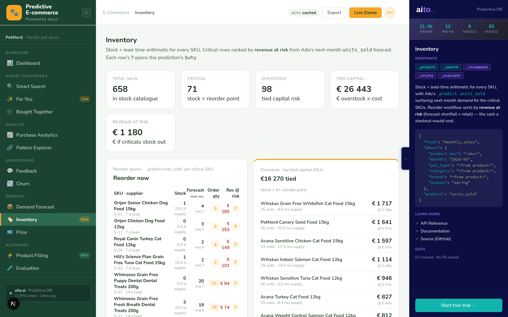

# Inventory Intelligence — the killer Operate view



*KPI strip with critical / overstock counts + tied capital € +
revenue at risk € · reorder queue ranked by revenue at risk, each
row scored by `_predict units_sold` for next month · overstock
list with tied-capital figures. The merchandiser's daily
dashboard.*

## Overview

The most economically-relevant question in merchandising:
*which SKUs need a reorder right now, and what's the cash
exposure if we don't?* This view runs the arithmetic, layers
Aito's demand forecast on top, and sorts by **revenue at risk**
— the euros a stockout would cost.

Three blocks per page load:

1. **KPI strip** — total SKUs / critical / overstock / tied
   capital € / revenue at risk €
2. **Reorder queue** — critical SKUs deep-scored with `_predict
   units_sold`, sorted by revenue at risk descending
3. **Overstock list** — top tied-capital SKUs with months-of-supply

## How it works

### Critical SKU classification

```python
def _band(current, reorder_point):
    if current < reorder_point:           return "critical"
    if current < reorder_point * 1.5:     return "low"
    if current > reorder_point * 5:       return "overstock"
    return "ok"
```

Pure arithmetic; runs over the fetched `inventory` table rows
without any Aito calls.

### Reorder queue — `_predict` per critical SKU

```python
# src/inventory_service.py — _predict_demand()
where = {
    "product_sku": sku,
    "month":       "2026-05",        # next month
    "pet_type":    recent["pet_type"],
    "category":    recent["category"],
    "brand":       recent["brand"],
    "season":      "spring",
}
res = client.predict("monthly_sales", where=where,
                     predict_field="units_sold", limit=3)
top = res["hits"][0]
forecast_units = int(top["feature"])
```

Same query body Demand Forecast runs. Inventory consumes the
forecast as input.

### Revenue at risk

```python
shortfall = max(0, forecast_units - current_stock)
revenue_at_risk = shortfall * retail_price
```

If next month's forecast is 50 units and stock is 12, the
shortfall is 38 units × €18.50 = €703 of revenue at risk on that
one SKU. The KPI strip's "Revenue at risk" sums these across all
critical SKUs.

### Suggested reorder qty

```python
suggested = max(0, forecast_units + safety_stock - current_stock)
```

Meet next month's forecast and rebuild the safety buffer. The
column shows the buy quantity the user would tell the supplier.

### Tied capital (overstock side)

```python
excess_units = max(0, current_stock - 2 * reorder_point)
tied_capital = excess_units * unit_cost_eur
```

For overstock SKUs (stock > 5× reorder_point), what's tied up
above a reasonable holding level. The KPI strip's "Tied capital"
sums these.

## Key features

### 1. Revenue at risk as the ranking key

Not "lowest days-of-supply" (which biases toward fast movers
regardless of margin) and not "highest stockout probability"
(Aito's `$p` is per-prediction, not per-SKU). Revenue at risk
combines volume × price into the single number a merchandiser
cares about.

### 2. Per-row `?` popover with the demand `$why`

Each reorder row carries the full `$why` from its forecast
predict. Click ? to see: "Aito forecasts 38 units because:
brand=Royal Canin (lift 1.3×), category=dry-food (lift 1.1×),
season=spring (lift 0.95×)…". The decision is auditable.

### 3. Reuses Demand's query shape

Same `_predict units_sold` body, just filtered to the critical
band. Cache keys differ; the underlying Aito work overlaps. A
warm Demand cache makes Inventory cold-loads faster (the L2
Aito-table layer holds the predict results).

## Data schema

```json
{
  "inventory": {
    "type": "table",
    "columns": {
      "sku":                 { "type": "String", "link": "products.sku" },
      "current_stock":       { "type": "Int" },
      "unit_cost_eur":       { "type": "Decimal" },
      "lead_time_days":      { "type": "Int" },
      "reorder_point":       { "type": "Int" },
      "safety_stock":        { "type": "Int" },
      "supplier":            { "type": "String" },
      "last_received_month": { "type": "String" }
    }
  }
}
```

658 rows, one per SKU. Engineered band distribution: ~10 %
critical / ~25 % low / ~50 % ok / ~15 % overstock — sized so the
demo's reorder workflow always has visible traffic.

## Tradeoffs and gotchas

- **The "Reorder now" button is a no-op visually**. Production
  would persist a draft PO; we render a toast and move on.
- **Forecasts are next-month-only**. Lead times > 30 days
  (aquarium accessories at 28 d) get marginal coverage from a
  single-month horizon. A 3-month horizon would need separate
  models per horizon.
- **Tied-capital threshold** (`stock > 2 × reorder_point`) is
  a design call. A finance team would calibrate this to their
  cost-of-capital. We picked 2× because below it the "excess"
  drops to zero quickly; above it the demo overstates exposure.
- **`_predict` cap at 25 SKUs**. The critical band can carry
  ~75 SKUs at the engineered distribution; we score the top 25
  by some-criterion (sample order in the response) to keep the
  Aito fan-out bounded. Production would score everything
  offline nightly.

## What this demo abstracts away

- **Real PO workflow** (supplier portal integration, EDI / ASN)
- **Multi-warehouse stock** (per-location quantities)
- **Stochastic safety stock** (newsvendor / service-level target)
- **Demand variance**. Aito returns a point estimate; we don't
  surface "P50 vs P90" forecasts that real planning uses for
  inventory buffers.

## Try it live

[**Open Inventory**](http://localhost:8500/inventory/). Cold load
~5 s (25 parallel `_predict` calls); cached for 30 minutes.
Watch the "Revenue at risk" KPI — the engineered fixture lands
in the **€1,000-€2,000** range, with the top reorder row often
above €500.
